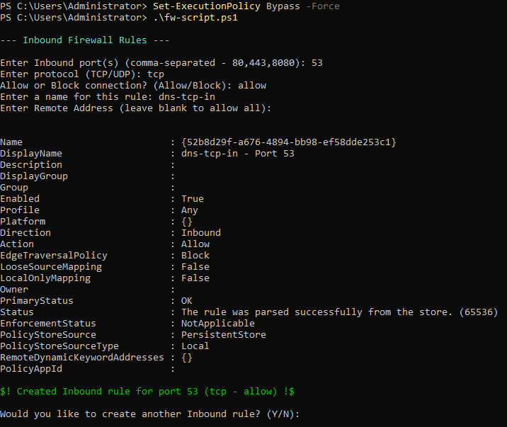

# windows-firewall-script
A dynamic PowerShell script for securing network communications, based off user input.

## Disclaimer
> [!CAUTION]
> ***THIS SCRIPT WILL NOT WORK OUT OF THE BOX FOR REMOTE CONNECTIONS, YOUR SESSION WILL END***

## How to Use
The script goes from rule to rule. Once you no longer want to make inbound rules, you will be prompted to make outbound rules. When you no longer want to make outbound rules, the script stops.

1. Launch PowerShell as Administrator.
2. Navigate to the script's directory.
3. The script is unsigned and from the internet so you will need to momentarily bypass the execution policy.
```
Set-ExecutionPolicy Bypass -Force
```
4. Run the script. No need to call the function as it is called at the end of the script.
5. Enter the variables desired.


## Features
- Asks user for ports
- Asks user for the protocol (TCP/UDP)
- Asks user if the rule will allow or block the connection
- Asks user for the rule's display name
- Asks user for a remote address (optional)
- Asks user if they would like to create more rules for the current direction
- Asks user for inbound and outbound rules

## History
I first created this script in April 2025 as I was preparing for NCCDC. \
This script ultimately was not used as we deemed it take up too much time, and in NCCDC, you need all the time you can get in the early stages. \
We eventually went on to using a more static script that had everything, and we could manually create rules later if needed. \
This was still a fun challenge to get working. I would like to expand on this, eventually.